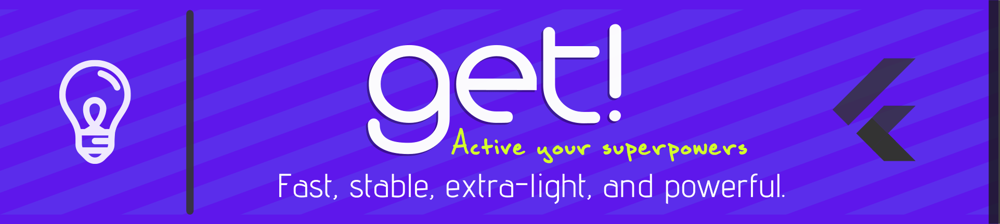
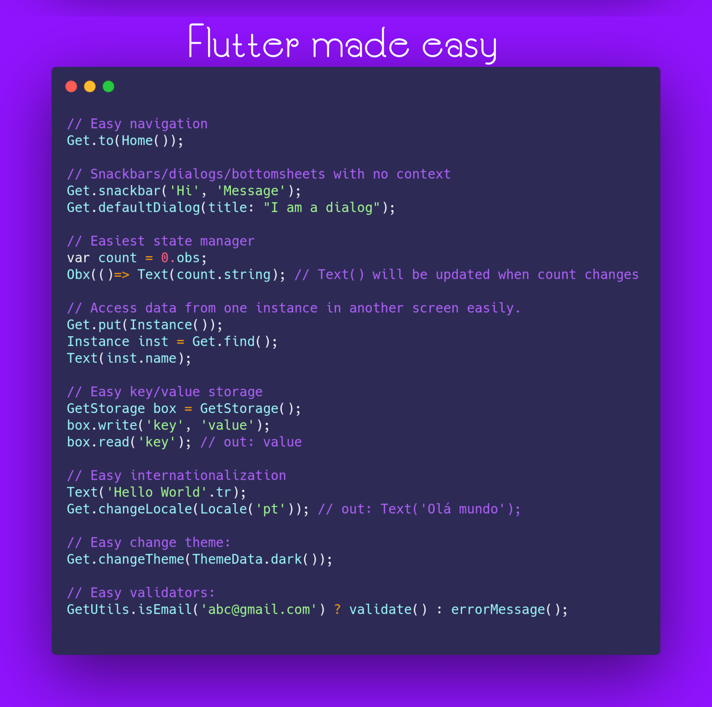

*Idiomas: [Inglês](README.md), [Língua chinesa](README.zh-cn.md), Português Brasileiro (este arquivo), [Espanhol](README-es.md), [Polaco](README.pl.md).*

[](https://pub.dev/packages/get)

[](https://pub.dev/packages/effective_dart)
[](https://discord.com/invite/9Hpt99N)
[](https://communityinviter.com/apps/getxworkspace/getx)
[](https://t.me/joinchat/PhdbJRmsZNpAqSLJL6bH7g)
<a href="https://github.com/Solido/awesome-flutter">
   
</a>
<a href="https://www.buymeacoffee.com/jonataslaw" target="_blank"> </a>




<h2> Pedimos desculpas por qualquer parte não traduzida aqui. O GetX™ é atualizado com muita frequência e as traduções podem não vir ao mesmo tempo. Então, para manter essa documentação pelo menos com tudo que a versão em inglês tem, eu vou deixar todos os textos não-traduzidos aqui (eu considero que é melhor ele estar lá em inglês do que não estar), então se alguém quiser traduzir, seria muito útil 😁</h2>

- [Sobre Get](#sobre-get)
- [Instalando](#instalando)
- [App Counter usando GetX](#app-counter-usando-getx)
- [Os três pilares](#os-três-pilares)
  - [Gerenciamento de estado](#gerenciamento-de-estado)
    - [Reactive state manager](#reactive-state-manager)
    - [Mais detalhes sobre gerenciamento de estado](#mais-detalhes-sobre-gerenciamento-de-estado)
    - [Explicação em video do gerenciamento de estado](#explicação-em-video-do-gerenciamento-de-estado)
  - [Gerenciamento de rotas](#gerenciamento-de-rotas)
    - [Mais detalhes sobre gerenciamento de rotas](#mais-detalhes-sobre-gerenciamento-de-rotas)
    - [Explicação em video do gerenciamento de rotas](#explicação-em-video-do-gerenciamento-de-rotas)
  - [Gerenciamento de Dependência](#gerenciamento-de-dependência)
    - [Mais detalhes sobre gerenciamento de dependências](#mais-detalhes-sobre-gerenciamento-de-dependências)
- [Utilidades](#utilidades)
  - [Internacionalização](#internacionalização)
    - [Traduções](#traduções)
      - [Usando traduções](#usando-traduções)
    - [Localidade](#localidade)
      - [Alterar Local](#alterar-local)
      - [Localidade do sistema operacional](#localidade-do-sistema-operacional)
  - [Mudar tema (changeTheme)](#mudar-tema-changetheme)
  - [Outras APIs avançadas](#outras-apis-avançadas)
    - [Configurações Globais opcionais e configurações manuais](#configurações-globais-opcionais-e-configurações-manuais)
    - [Widgets de Estado Local](#widgets-de-estado-local)
      - [ValueBuilder](#valuebuilder)
      - [ObxValue](#obxvalue)
  - [Dicas Úteis](#dicas-úteis)
      - [GetView](#getview)
      - [GetWidget](#getwidget)
      - [GetxService](#getxservice)
  - [Explicação em vídeo sobre Outras Features do GetX](#explicação-em-vídeo-sobre-outras-features-do-getx)
- [Breaking Changes da versão 2 para 3](#breaking-changes-da-versão-2-para-3)
  - [Tipagem Rx](#tipagem-rx)
  - [RxController e GetBuilder se uniram](#rxcontroller-e-getbuilder-se-uniram)
  - [Rotas nomeadas](#rotas-nomeadas)
    - [Porque essa mudança](#porque-essa-mudança)
- [Por que GetX?](#por-que-getx)
- [Comunidade](#comunidade)
  - [Canais da comunidade](#canais-da-comunidade)
  - [Como contribuir](#como-contribuir)
  - [Artigos e vídeos](#artigos-e-vídeos)

# Sobre Get

- Get é uma biblioteca poderosa e extraleve para Flutter. Ela combina um gerenciador de estado de alta performance, injeção de dependência inteligente e gerenciamento de rotas de uma forma rápida e prática.
- GetX™ possui 3 princípios básicos, o que significa que esta é a prioridade para todos os recursos da biblioteca
  - **PERFOMANCE**: GetX™ é focado em desempenho e consumo mínimo de recursos. Os benchmarks quase sempre não são importantes no mundo real, mas se você quiser, há um indicador de consumo aqui ([benchmarks](https://github.com/jonataslaw/benchmarks)), onde GetX™ se sai melhor do que outras abordagens de gerenciamento de estado, por exemplo. A diferença não é grande, mas mostra nossa preocupação em não desperdiçar seus recursos.
  - **PRODUTIVIDADE**: GetX™ usa uma sintaxe fácil e agradável. Não importa o que você queira fazer, sempre há uma maneira mais fácil com GetX™. Isso economizará horas de desenvolvimento e extrairá o máximo de desempenho que seu aplicativo pode oferecer.
  - **ORGANIZAÇÃO**: GetX™ permite o desacoplamento total da View, lógica de apresentação, lógica de negócios, injeção de dependência e navegação. Você não precisa de contexto para navegar entre as rotas, portanto, você não depende da árvore do widget (visualização) para isso. Você não precisa de contexto para acessar seus Controllers / BLoCs por meio de um inheritedWidget, então você desacopla completamente sua lógica de apresentação e lógica de negócios de sua camada de visualização. Você não precisa injetar suas classes Controllers / Models / BLoCs em sua árvore de widgets através de multiproviders, pois GetX™ usa seu próprio recurso de injeção de dependência, desacoplando a DI de sua View completamente. Com GetX™ você sabe onde encontrar cada recurso de sua aplicação, tendo o código limpo por padrão. Isso além de facilitar a manutenção, torna o compartilhamento dos módulos, algo que até então em Flutter era impensável, algo totalmente possível. O BLoC foi um ponto de partida para organizar o código no Flutter, ele separa a lógica de negócios da visualização. GetX™ é uma evolução natural disso, separando não apenas a lógica de negócios, mas a lógica de apresentação. O bônus da injeção de dependências e rotas também são dissociadas e a camada de dados está fora de tudo. Você sabe onde está tudo e tudo isso de uma maneira mais fácil do que construir um hello world. GetX™ é a maneira mais fácil, prática e escalonável de construir aplicativos de alto desempenho com o Flutter SDK, com um grande ecossistema em torno dele que funciona perfeitamente em conjunto, sendo fácil para iniciantes e preciso para especialistas. É seguro, estável, atualizado e oferece uma grande variedade de APIs integradas que não estão presentes no Flutter SDK padrão.
- GetX™ não é inchado. Possui uma infinidade de recursos que permitem que você comece a programar sem se preocupar com nada, mas cada um desses recursos está em contêineres separados e só são iniciados após o uso. Se você usar apenas o Gerenciamento de estado, apenas o Gerenciamento de estado será compilado. Se você usar apenas rotas, nada do gerenciamento de estado será compilado. Você pode compilar o repositório de benchmark e verá que usando apenas o gerenciamento de estado Get, o aplicativo compilado com Get tornou-se menor do que todos os outros aplicativos que têm apenas o gerenciamento de estado de outros pacotes, porque nada que não seja usado será compilado em seu código e cada solução GetX™ foi projetada para ser extra leve. O mérito aqui também vem do tree shaking do Flutter, que é incrível e consegue eliminar recursos não utilizados como nenhum outro framework faz.
- Navegue por rotas sem `context`, abra `Dialog`s, `Snackbar`s ou `BottomSheet`s de qualquer lugar no código, gerencie estados e injete dependências de uma forma simples e prática.
- GetX™ possui um enorme ecossistema, capaz de rodar com o mesmo código no Android, iOS, Web, Mac, Linux, Windows e em seu servidor. É possível reutilizar totalmente o código feito no front-end em seu back-end com **[Get Server](https://github.com/jonataslaw/get_server)**.

Além disso, todo o processo de desenvolvimento pode ser totalmente automatizado, tanto no servidor quanto no front-end com **[Get CLI](https://github.com/jonataslaw/get_cli)**.

Além disso, para aumentar ainda mais sua produtividade, temos a **[extensão para VSCode](https://marketplace.visualstudio.com/items?itemName=get-snippets.get-snippets)** e a **[extensão para Android Studio/Intellij](https://plugins.jetbrains.com/plugin/14975-getx-snippets)**

# Instalando

Adicione Get ao seu arquivo pubspec.yaml

```yaml
dependencies:
  get:
```

Importe o get nos arquivos que ele for usado:

```dart
import 'package:get/get.dart';
```

# App Counter usando GetX

O app 'Counter' criado por padrão no flutter com o comando `flutter create` tem mais de 100 linhas(incluindo os comentários). Para demonstrar o poder do Get, irei demonstrar como fazer o mesmo 'Counter' mudando o estado em cada toque trocando entre páginas e compartilhando o estado entre telas. Tudo de forma organizada, separando a lógica de negócio da View, COM SOMENTE 26 LINHAS INCLUINDO COMENTÁRIOS

- Passo 1:
Troque `MaterialApp` para `GetMaterialApp`

```dart
void main() => runApp(GetMaterialApp(home: Home()));
```

- **Obs:** Isso não modifica o `MaterialApp` do Flutter, GetMaterialApp não é uma versão modificada do MaterialApp, é só um Widget pré-configurado, que tem como child o MaterialApp padrão. Você pode configurar isso manualmente, mas definitivamente não é necessário. GetMaterialApp vai criar rotas, injetá-las, injetar traduções, injetar tudo que você precisa para navegação por rotas (gerenciamento de rotas). Se você quer somente usar o gerenciador de estado ou somente o gerenciador de dependências, não é necessário usar o GetMaterialApp. Ele somente é necessário para:
  - Rotas
  - Snackbars/bottomsheets/dialogs
  - apis relacionadas a rotas e a ausência de `context`
  - Internacionalização
- **Obs²:** Esse passo só é necessário se você for usar o gerenciamento de rotas (`Get.to()`, `Get.back()` e assim por diante), Se você não vai usar isso então não é necessário seguir o passo 1

- Passo 2:
Cria a sua classe de regra de negócio e coloque todas as variáveis, métodos e controllers dentro dela.
Você pode fazer qualquer variável observável usando um simples `.obs`

```dart
class Controller extends GetxController{
  var count = 0.obs;
  increment() => count.value++;
}
```

- Passo 3:
Crie sua View usando StatelessWidget, já que, usando Get, você não precisa mais usar StatefulWidgets.

```dart
class Home extends StatelessWidget {
  // Instancie sua classe usando Get.put() para torná-la disponível para todas as rotas subsequentes
  final Controller c = Get.put(Controller());
  @override
  Widget build(context) => Scaffold(
    appBar: AppBar(title: Obx(() => Text("Total de cliques: ${c.count}"))),
      // Troque o Navigator.push de 8 linhas por um simples Get.to(). Você não precisa do 'context'
    body: Center(child: RaisedButton(
      child: Text("Ir pra Outra tela"), onPressed: () => Get.to(Outra()))),
    floatingActionButton: FloatingActionButton(child:
     Icon(Icons.add), onPressed: c.increment));
}

class Outra extends StatelessWidget {
  // Você pode pedir o Get para encontrar o controller que foi usado em outra página e redirecionar você pra ele.
  final Controller c = Get.find();
  @override
  Widget build(context) => Scaffold(body: Center(child: Text("${c.count}")));
}

```

Resultado:


Esse é um projeto simples mas já deixa claro o quão poderoso o Get é. Enquanto seu projeto cresce, essa diferença se torna bem mais significante.

Get foi feito para funcionar com times, mas torna o trabalho de um desenvolvedor individual simples.

Melhore seus prazos, entregue tudo a tempo sem perder performance. Get não é para todos, mas se você identificar com o que foi dito acima, Get é para você!


# Os três pilares

## Gerenciamento de estado

Há atualmente vários gerenciadores de estados para o Flutter. Porém, a maioria deles envolve usar `ChangeNotifier` para atualizar os widgets e isso é uma abordagem muito ruim no quesito performance em aplicações de médio ou grande porte. Você pode checar na documentação oficial do Flutter que o [`ChangeNotifier` deveria ser usado com um ou no máximo dois listeners](https://api.flutter.dev/flutter/foundation/ChangeNotifier-class.html), fazendo-o praticamente inutilizável em qualquer aplicação média ou grande.

Get não é melhor ou pior que nenhum gerenciador de estado, mas você deveria analisar esses pontos tanto quanto os argumentos abaixo para escolher entre usar Get na sua forma pura, ou usando-o em conjunto com outro gerenciador de estado.

Definitivamente, Get não é o inimigo de nenhum gerenciador, porque Get é um microframework, não apenas um gerenciador, e pode ser usado tanto sozinho quanto em conjunto com eles.

Get tem dois gerenciadores de estado diferentes: o simple state manager (vamos chamá-lo de GetBuilder) e o reactive state manager (que tem o nome do pacote, GetX)

### Reactive state manager

Programação reativa pode alienar muitas pessoas porque é dito que é complicado. GetX™ transforma a programação reativa em algo bem simples:

* Você não precisa criar StreamControllers
* Você não precisa criar um StreamBuilder para cada variável
* Você não precisa criar uma classe para cada estado
* Você não precisa criar um get para o valor inicial

Programação reativa com o Get é tão fácil quanto usar setState.

Vamos imaginar que você tenha uma variável e quer que toda vez que ela alterar, todos os widgets que a usam são automaticamente alterados.

Essa é sua variável:

```dart
var name = 'Jonatas Borges';
```

Para fazer dela uma variável observável, você só precisa adicionar `.obs` no final:

```dart
var name = 'Jonatas Borges'.obs;
```

E Na UI, quando quiser mostrar a variável e escutar as mudanças dela, simplesmente faça isso:

```dart
Obx (() => Text (controller.name));
```

Só isso. É *simples assim*;

### Mais detalhes sobre gerenciamento de estado

**Veja uma explicação mais completa do gerenciamento de estado [aqui](./documentation/pt_BR/state_management.md). Lá terá mais exemplos e também a diferença do simple state manager do reactive state manager**

### Explicação em video do gerenciamento de estado

Amateur Coder fez um vídeo ótimo sobre o gerenciamento de estado! (em inglês). Link: [Complete GetX State Management](https://www.youtube.com/watch?v=CNpXbeI_slw)

Você vai ter uma boa idea do poder do GetX™

## Gerenciamento de rotas

Se você for usar routes / snackbars / dialogs / bottomsheets sem contexto, GetX™ é excelente para você também, veja:

Adicione "Get" antes do seu MaterialApp, transformando-o em GetMaterialApp

```dart
GetMaterialApp( // Antes: MaterialApp(
  home: MyHome(),
)
```

Para navegar para uma próxima tela:

```dart
Get.to(ProximaTela());
```

Para fechar snackbars, dialogs, bottomsheets, ou qualquer coisa que você normalmente fecharia com o `Navigator.pop(context)` (como por exemplo fechar a View atual e voltar para a anterior):

```dart
Get.back();
```

Para ir para a próxima tela e NÃO deixar opção para voltar para a tela anterior (bom para SplashScreens, telas de login e etc.):

```dart
Get.off(ProximaTela());
```

Para ir para a próxima tela e cancelar todas as rotas anteriores (útil em telas de carrinho, votações ou testes):

```dart
Get.offAll(ProximaTela());
```

Para navegar para a próxima rota e receber ou atualizar dados assim que retornar da rota:

```dart
var dados = await Get.to(Pagamento());
```

Notou que você não precisou usar `context` para fazer nenhuma dessas coisas? Essa é uma das maiores vantagens de usar o gerenciamento de rotas do GetX™. Com isso, você pode executar todos esse métodos de dentro da classe Controller, sem preocupações.

### Mais detalhes sobre gerenciamento de rotas

**GetX™ funciona com rotas nomeadas também! Veja uma explicação mais completa do gerenciamento de rotas [aqui](./documentation/pt_BR/route_management.md)**

### Explicação em video do gerenciamento de rotas

Amateur Coder fez um outro vídeo excelente sobre gerenciamento de rotas! Link: [Complete Getx Navigation](https://www.youtube.com/watch?v=RaqPIoJSTtI)

## Gerenciamento de Dependência

- Nota: Se você está usando o gerenciador de estado do Get, você não precisa se preocupar com isso, só leia a documentação, mas dê uma atenção a api `Bindings`, que vai fazer tudo isso automaticamente para você.

Já está usando o Get e quer fazer seu projeto o melhor possível? Get tem um gerenciador de dependência simples e poderoso que permite você pegar a mesma classe que seu Bloc ou Controller com apenas uma linha de código, sem Provider context, sem inheritedWidget:

```dart
Controller controller = Get.put(Controller()); // Em vez de Controller controller = Controller();
```

Em vez de instanciar sua classe dentro da classe que você está usando, você está instanciando ele dentro da instância do Get, que vai fazer ele ficar disponível por todo o App para que então você possa usar seu controller (ou uma classe Bloc) normalmente


**Dica:** O gerenciamento de dependência Get é desacoplado de outras partes do pacote, então se, por exemplo, seu aplicativo já estiver usando um gerenciador de estado (qualquer um, não importa), você não precisa reescrever tudo, você pode usar esta injeção de dependência sem problemas

```dart
controller.fetchApi();
```

Agora, imagine que você navegou por inúmeras rotas e precisa de dados que foram deixados para trás em seu controlador. Você precisaria de um gerenciador de estado combinado com o Provider ou Get_it, correto? Não com Get. Você só precisa pedir ao Get para "procurar" pelo seu controlador, você não precisa de nenhuma dependência adicional para isso:

```dart
Controller controller = Get.find();
// Sim, parece Magia, o Get irá descobrir qual é seu controller e irá te entregar.
// Você pode ter 1 milhão de controllers instanciados, o Get sempre te entregará o controller correto.
// Apenas se lembre de Tipar seu controller, final controller = Get.find(); por exemplo, não irá funcionar.
```

E então você será capaz de recuperar os dados do seu controller que foram obtidos anteriormente:

```dart
Text(controller.textFromApi);
```

Procurando por `lazyLoading` (carregar somente quando for usar)? Você pode declarar todos os seus controllers e eles só vão ser inicializados e chamados quando alguém precisar. Você pode fazer isso

```dart
Get.lazyPut<Service>(()=> ApiMock());
/// ApiMock só será chamado quando alguém usar o Get.find<Service> pela primeira vez
```

### Mais detalhes sobre gerenciamento de dependências

**Veja uma explicação mais completa do gerenciamento de dependência [aqui](./documentation/pt_BR/dependency_management.md)**

# Utilidades

## Internacionalização
### Traduções
Nós mantemos as traduções num simples dictionary map de chave-valor.
Para adicionar traduções personalizadas, crie uma classe e estenda `Translations`.

```dart
import 'package:get/get.dart';

class Messages extends Translations {
  @override
  Map<String, Map<String, String>> get keys => {
    'en_US': {
      'hello': 'Hello World',
    },
    'de_DE': {
      'hello': 'Hallo Welt',
    }
  };
}
```

#### Usando traduções
Basta anexar `.tr` a chave especificada e ela será traduzida, usando o valor atual de `Get.locale` ou `Get.fallbackLocale`.
```dart
Text('hello'.tr);
```

### Localidade
Passe parâmetros para `GetMaterialApp` definir a localidade e as traduções.

```dart
return GetMaterialApp(
    translations: Messages(), // suas traduções
    locale: Locale('en', 'US'), // as traduções serão exibidas para esta localidade
    fallbackLocale: Locale('en', 'UK'), // especifica uma localidade em caso de falha na localidade definida
);
```

#### Alterar local
Use `Get.updateLocale(locale)` para atualizar a localidade. As traduções usarão automaticamente a nova localidade e a UI será atualizada.
```dart
var locale = Locale('en', 'US');
Get.updateLocale(locale);
```

#### Localidade do sistema operacional
Para ler a localidade do sistema operacional, você pode usar `window.locale`.
```dart
import 'dart:ui' as ui;

return GetMaterialApp(
    locale: ui.window.locale,
);
```

## Mudar tema (changeTheme)

Por favor não use widget acima do GetMaterialApp para atualizar o tema. Isso pode causar keys duplicadas. Várias pessoas estão acostumadas com o jeito normal de criar um Widget `ThemeProvider` só pra alterar o tema do app, mas isso definitivamente NÃO é necessário com GetX™.

Você pode criar seu tema customizado e simplesmente adicionar dentro do `Get.changeTheme` sem nenhum boilerplate para isso:

```dart
Get.changeTheme(ThemeData.light())
```

Se você quer criar algo como um botão que muda o tema com o toque, você pode combinar duas APIs GetX™ pra isso:
- A API que checa se o tema dark está sendo aplicado;
- A API de mudar o tema e colocar isso no `onPressed:`

```dart
Get.changeTheme(Get.isDarkMode ? ThemeData.light() : ThemeData.dark())
```

Quando o modo Dark está ativado, ele vai trocar pro modo light e vice versa.

Se você quiser saber mais como trocar o tema, você pode seguir esse tutorial no Medium que até ensina persistência do tema usando Get (e SharedPreferences):

- [Dynamic Themes in 3 lines using Get](https://medium.com/swlh/flutter-dynamic-themes-in-3-lines-c3b375f292e3) - Tutorial by [Rod Brown](https://github.com/RodBr).

## Outras APIs avançadas

```dart
// fornece os arguments da tela atual
Get.arguments

// fornece os arguments da rota anterior
Get.previousArguments

// fornece o nome da rota anterior
Get.previousRoute

// fornece a rota bruta para acessar por exemplo, rawRoute.isFirst()
Get.rawRoute

// fornece acesso a API de rotas de dentro do GetObserver
Get.routing

// checa se o snackbar está aberto
Get.isSnackbarOpen

// checa se o dialog está aberto
Get.isDialogOpen

// checa se o bottomsheet está aberto
Get.isBottomSheetOpen

// remove uma rota.
Get.removeRoute()

// volta repetidamente até o predicate retorne true.
Get.until()

// vá para a próxima rota e remove todas as rotas
//anteriores até que o predicate retorne true.
Get.offUntil()

// vá para a próxima rota nomeada e remove todas as
//rotas anteriores até que o predicate retorne true.
Get.offNamedUntil()

// Verifica em que plataforma o app está sendo executado
// (Esse método é completamente compatível com o FlutterWeb,
// diferente do método do framework "Platform.isAndroid")
GetPlatform.isAndroid
GetPlatform.isIOS
GetPlatform.isMacOS
GetPlatform.isWindows
GetPlatform.isLinux
GetPlatform.isFuchsia

// Verifica o tipo de dispositivo
GetPlatform.isMobile
GetPlatform.isDesktop
// Todas as plataformas são suportadas de forma independente na web!
// Você pode saber se está executando dentro de um navegador
// no Windows, iOS, OSX, Android, etc.
GetPlatform.isWeb

// Equivalente ao método: MediaQuery.of(context).size.width ou height, mas é imutável. 
// Significa que não irá atualizar mesmo que o tamanho da tela mude (como em navegadores ou app desktop)
Get.height
Get.width

// fornece o context da tela em qualquer lugar do seu código.
Get.context

// fornece o context de snackbar/dialog/bottomsheet em qualquer lugar do seu código.
Get.contextOverlay

// Obs: os métodos a seguir são extensions do context. Já que se
// tem acesso ao context em qualquer lugar do código da UI, você pode usar lá

// Se você precisa de um width/height adaptável (como em navegadores em que a janela pode ser redimensionada) 
// você precisa usar 'context'
context.width
context.height

// Dá a você agora o poder de definir metade da tela, um terço da dela e assim por diante.
// Útil para aplicativos responsivos.
// param dividedBy (double) opcional - default: 1
// param reducedBy (double) opcional - default: 0
context.heightTransformer()
context.widthTransformer()

/// similar a MediaQuery.of(context).size
context.mediaQuerySize()

/// similar a MediaQuery.of(this).padding
context.mediaQueryPadding()

/// similar a MediaQuery.of(this).viewPadding
context.mediaQueryViewPadding()

/// similar a MediaQuery.of(this).viewInsets;
context.mediaQueryViewInsets()

/// similar a MediaQuery.of(this).orientation;
context.orientation()

/// verifica se o dispositivo está no modo paisagem
context.isLandscape()

/// verifica se o dispositivo está no modo retrato
context.isPortrait()

/// similar a MediaQuery.of(this).devicePixelRatio;
context.devicePixelRatio()

/// similar a MediaQuery.of(this).textScaleFactor;
context.textScaleFactor()

/// obtém a menor dimensão (largura ou altura) da tela
context.mediaQueryShortestSide()

/// retorna True se a largura da tela for maior que 800px
context.showNavbar()

/// retorna True se a menor dimensão (largura ou altura) da tela for menor que 600px
context.isPhone()

/// retorna True se a menor dimensão (largura ou altura) da tela for maior ou igual a 600px
context.isSmallTablet()

/// retorna True se a menor dimensão (largura ou altura) da tela for maior ou igual a 720px
context.isLargeTablet()

/// retorna True se o dispositivo é um Tablet
context.isTablet()

/// Retorna um valor de acordo com o tamanho da tela
/// Os valores possíveis são:
/// swatch: se a menor dimensão (largura ou altura) da tela for menor que 300px
/// mobile: se a menor dimensão (largura ou altura) da tela for menor que 600px
/// tablet: se a menor dimensão (largura ou altura) da tela for menor que 1200px
/// desktop: se a largura da tela é maior ou iguial a 1200px  
context.responsiveValue<T>()
```

### Configurações Globais opcionais e configurações manuais

GetMaterialApp configura tudo para você, mas se quiser configurar Get manualmente, você pode.

```dart
MaterialApp(
  navigatorKey: Get.key,
  navigatorObservers: [GetObserver()],
);
```

Você também será capaz de usar seu próprio Middleware dentro do GetObserver, isso não irá influenciar em nada.

```dart
MaterialApp(
  navigatorKey: Get.key,
  navigatorObservers: [
    GetObserver(MiddleWare.observer) // Aqui
  ],
);
```

Você pode criar Configurações Globais para o Get. Apenas adicione `Get.config` ao seu código antes de usar qualquer rota ou faça diretamente no seu GetMaterialApp

```dart
GetMaterialApp(
  enableLog: true,
  defaultTransition: Transition.fade,
  opaqueRoute: Get.isOpaqueRouteDefault,
  popGesture: Get.isPopGestureEnable,
  transitionDuration: Get.defaultDurationTransition,
  defaultGlobalState: Get.defaultGlobalState,
);
Get.config(
  enableLog = true,
  defaultPopGesture = true,
  defaultTransition = Transitions.cupertino
)
```

É possível redirecionar todas as mensagens de log do GetX™. Útil quando se tem um package de logging e vc quer que ele lide com todos os logs

```dart
GetMaterialApp(
  enableLog: true,
  logWriterCallback: localLogWriter,
);

void localLogWriter(String text, {bool isError = false}) {
  // passage a mensagem para seu package de logging favorito aqui
  // Obs: mesmo que as mensagens de log estejam desativadas
  // com o comando "enableLog: false", as mensagens ainda vão passar por aqui
  // Você precisa checar essa config manualmente aqui se quiser respeitá-la
}
```

### Widgets de Estado Local

Esses Widgets permitem que você gerencie um único valor e mantenha o estado efêmero e localmente. Temos versões para Reativo e Simples. Por exemplo, você pode usá-los para alternar obscureText em um `TextField`, talvez criar um painel expansível personalizado ou talvez modificar o índice atual em um `BottomNavigationBar` enquanto altera o conteúdo do corpo em um `Scaffold`.

#### ValueBuilder
Uma simplificação de `StatefulWidget` que funciona com um callback de `setState` que passa o valor atualizado.


```dart
ValueBuilder<bool>(
  initialValue: false,
  builder: (value, updateFn) => Switch(
    value: value,
    onChanged: updateFn, // mesma assinatura! Você poderia usar ( newValue ) => updateFn( newValue )
  ),
  // se você precisa chamar algo fora do método builder.
  onUpdate: (value) => print("Valor atualizado: $value"),
  onDispose: () => print("Widget desmontado"),   
),
```

#### ObxValue
Similar a ValueBuilder, mas esta é a versão Reativa, você passa uma instância Rx (lembra do .obs mágico?) e 
atualiza automaticamente... não é incrível?

```dart
ObxValue(
  (data) => Switch(
    value: data.value,
    onChanged: data, // Rx tem uma função _callable_! Você poderia usar (flag) => data.value = flag,
  ),
  false.obs,
),
```

### Explicação em vídeo sobre Outras Features do GetX

Amateur Coder fez um vídeo incrível sobre utils, storage, bindings e outras features! Link: [GetX Other Features](https://youtu.be/ttQtlX_Q0eU)


## Dicas Úteis

`.obs`ervables (também conhecidos como _Rx_ Types) possuem uma grande variedade de métodos e operadores internos.

> É muito comum acreditar que uma propriedade com `.obs` **É** o valor real... mas não se engane!
> Evitamos a declaração de tipo da variável, porque o compilador do Dart é inteligente o suficiente e o código
> parece mais limpo, mas:

```dart
var message = 'Hello world'.obs;
print( 'Message "$message" é do tipo ${message.runtimeType}');
```

Mesmo que `message` _imprima_ o valor da string, seu tipo é **RxString**!

Então, você não pode fazer `message.substring( 0, 4 )`.
Você tem que acessar o `valor` real dentro do _observable_:
A "maneira" mais usada é utilizando `.value`, mas, você sabia que também pode usar:

```dart
final name = 'GetX'.obs;
// apenas "atualiza" o stream, se o valor for diferente do atual.
name.value = 'Hey';

// Todas as propriedades Rx são "chamáveis" e retorna o novo valor.
// mas esta abordagem não aceita `null`, a UI não será reconstruída
name('Hello');

// é como um getter, imprime 'Hello'
name() ;

/// números:

final count = 0.obs;

// Você pode usar todas as operações não mutáveis ​​de um num! 
count + 1;

// Cuidado! isso só é válido se `count` não for final, mas var
count += 1;

// Você também pode comparar com os valores:
count > 2;

/// booleans:

final flag = false.obs;

// mude o valor entre true/false
flag.toggle();


/// todos os tipos:

// Defina `value` como null.
flag.nil();

// Todas as operações toString() e toJson() são passada para `value`
print( count ); // chama `toString()` de RxInt

final abc = [0,1,2].obs;
// Converte o valor em um Array json, imprime RxList
// Json é suportado por todos os Rx types!
print('json: ${jsonEncode(abc)}, type: ${abc.runtimeType}');

// RxMap, RxList e RxSet são Rx types especiais, que estendem seus tipos nativos.
// mas você pode trabalhar com uma lista como uma lista normal, embora seja reativa!
abc.add(12); // Coloca 12 na lista, e ATUALIZA o stream.
abc[3]; // como uma lista lê o índice 3.

// a igualdade funciona com o Rx e o value do observável, mas o hashCode é sempre obtido do value 
final number = 12.obs;
print( number == 12 ); // prints > true

/// Rx Models personalizados:

// toJson(), toString() são transferidos para o filho, para que você possa implementar 
// override neles e imprimir o observável diretamente.

class User {
    String name, last;
    int age;
    User({this.name, this.last, this.age});

    @override
    String toString() => '$name $last, $age years old';
}

final user = User(name: 'John', last: 'Doe', age: 33).obs;

// `user` é "reativo", mas as propriedades dentro NÃO SÃO!
// Então, se mudarmos alguma variável dentro dele:
user.value.name = 'Roi';
// O widget não vai reconstruir!,
// `Rx` não tem nenhuma notificação quando você muda algo dentro do usuário.
// Portanto, para classes personalizadas, precisamos "notificar" manualmente a mudança.
user.refresh();

// ou podemos usar o método `update()`!
user.update((value){
  value.name='Roi';
});

print( user ); // Resultado (toString): Roi Doe, 33 years old
```

#### GetView

Eu amo este Widget, é tão simples, mas tão útil!

É um Widget `const Stateless` que tem um getter `controller` registrado para Controller, só isso.

```dart
class AwesomeController extends GetxController {
  final String title = 'My Awesome View';
}

// SEMPRE lembre de passar o `Type` que você usou para registrar seu controlador!
class AwesomeView extends GetView<AwesomeController> {
  @override
  Widget build(BuildContext context) {
    return Container(
      padding: EdgeInsets.all(20),
      child: Text( controller.title ), // apenas chame `controller.something`
    );
  }
}
```

#### GetWidget

A maioria das pessoas não tem ideia sobre este widget, ou confunde totalmente o uso dele. 
O caso de uso é muito raro, mas muito específico: Ele armazena em `cache` um Controller. 
Por causa do _cache_, não pode ser um `const Stateless`.

> Então, quando você precisa armazenar em "cache" um Controller?

Se você usar, uma outra característica "não tão comum" de **GetX™**: `Get.create()`.

`Get.create(()=>Controller())` irá gerar um novo `Controller` cada vez que você chamar
`Get.find<Controller>()`,

É aí que `GetWidget` brilha... já que você pode usá-lo, por exemplo, 
para manter uma lista de itens Todo. Portanto, se o widget for "reconstruído", ele manterá a mesma instância do controlador.

#### GetxService

Esta classe é como um `GetxController`, ele compartilha o mesmo ciclo de vida ( `onInit()`, `onReady()`, `onClose()`). 
Mas não tem "lógica" dentro dele. Ele apenas notifica o sistema de injeção de dependência do GetX™ de que esta subclasse
**não pode** ser removida da memória.

Portanto, é muito útil manter seus "Services" sempre acessíveis e ativos com `Get.find()`. Como: 
`ApiService`, `StorageService`, `CacheService`.

```dart
Future<void> main() async {
  await initServices(); /// Aguarda a inicialização dos Services.
  runApp(SomeApp());
}

/// É uma jogada inteligente para inicializar seus services antes de executar o aplicativo Flutter, 
/// já que você pode controlar o fluxo de execução (talvez você precise carregar alguma configuração de tema, 
/// apiKey, linguagem definida pelo usuário ... então carregue SettingService antes de executar ApiService. 
/// então GetMaterialApp() não precisa reconstruir e obtém os valores diretamente.
void initServices() async {
  print('iniciando serviços...');
  /// Aqui é onde você coloca a inicialização de get_storage, hive, shared_pref. 
  /// ou checa a conexão, ou o que quer que seja assíncrono.
  await Get.putAsync(() => DbService().init());
  await Get.putAsync(SettingsService()).init();
  print('Todos os serviços iniciados.');
}

class DbService extends GetxService {
  Future<DbService> init() async {
    print('$runtimeType delays 2 sec');
    await 2.delay();
    print('$runtimeType ready!');
    return this;
  }
}

class SettingsService extends GetxService {
  void init() async {
    print('$runtimeType delays 1 sec');
    await 1.delay();
    print('$runtimeType ready!');
  }
}
```

A única maneira de realmente excluir um `GetxService`, é com o `Get.reset()`, que é como uma 
"hot restart" do seu aplicativo. Portanto, lembre-se, se você precisar de persistência absoluta de uma instância de classe durante
o ciclo de vida de seu aplicativo, use GetxService.


# Breaking Changes da versão 2 para 3

## Tipagem Rx

| Antes    | Depois     |
| -------- | ---------- |
| StringX  | `RxString` |
| IntX     | `RxInt`    |
| MapX     | `RxMap`    |
| ListX    | `RxList`   |
| NumX     | `RxNum`    |
| DoubleX  | `RxDouble` |

## RxController e GetBuilder se uniram

RxController e GetBuilder agora viraram um só, você não precisa mais memorizar qual controller quer usar, apenas coloque `GetxController`, vai funcionar para os dois gerenciamento de estados

```dart
//Gerenciador de estado simples
class Controller extends GetXController {
  String nome = '';

  void atualizarNome(String novoNome) {
    nome = novoNome;
    update()
  }
}
```

```dart
class Controller extends GetXController {
  final nome = ''.obs;

  // não precisa de um método direto pra atualizar o nome
  // só usar o nome.value
}
```

## Rotas nomeadas

Antes:

```dart
GetMaterialApp(
  namedRoutes: {
    '/': GetRoute(page: Home()),
  }
)
```

Agora:

```dart
GetMaterialApp(
  getPages: [
    GetPage(name: '/', page: () => Home()),
  ]
)
```

### Porque essa mudança?

Frequentemente, pode ser necessário decidir qual pagina vai ser mostrada ao usuário a partir de um parâmetro, como um token de login. A forma abordada anteriormente não era flexível, já que não permitia isso.

Inserir a página numa função reduziu significativamente o consumo de RAM, já que as rotas não são alocadas na memória no momento que o app é iniciado e também permite fazer esse tipo de abordagem:

```dart

GetStorage box = GetStorage();

GetMaterialApp(
  getPages: [
    GetPage(name: '/', page:(){  
      return box.hasData('token') ? Home() : Login();
    })
  ]
)
```

# Por que GetX™?

1- Muitas vezes após uma atualização do Flutter, muitos dos seus packages irão quebrar. As vezes acontecem erros de compilação, muitas vezes aparecem erros que ainda não existem respostas sobre e o desenvolvedor necessita saber de onde o erro veio, rastreá-lo, para só então tentar abrir uma issue no repositório correspondente e ver seu problema resolvido. Get centraliza os principais recursos para o desenvolvimento (Gerência de estado, de dependências e de rotas), permitindo você adicionar um único package em seu pubspec e começar a trabalhar. Após uma atualização do Flutter, a única coisa que você precisa fazer é atualizar a dependencia do Get e começar a trabalhar. Get também resolve problemas de compatibilidade. Quantas vezes uma versão de um package não é compatível com a versão de outro, porque um utiliza uma dependência em uma versão e o outro em outra versão? Essa também não é uma preocupação usando Get, já que tudo está no mesmo package e é totalmente compatível.

2- Flutter é fácil, Flutter é incrível, mas Flutter ainda tem algum boilerplate que pode ser indesejado para maioria dos desenvolvedores, como o Navigator.of(context).push(context, builder[...]. Get simplifica o desenvolvimento. Em vez de escrever 8 linhas de código para apenas chamar uma rota, você pode simplesmente fazer: Get.to(Home()) e pronto, você irá para a próxima página. Urls dinâmicas da web é algo realmente doloroso de fazer com o Flutter atualmente e isso com o GetX™ é estupidamente simples. Gerenciar estados no Flutter e gerenciar dependências também é algo que gera muita discussão, por haver centenas de padrões na pub. Mas não há nada que seja tão fácil quanto adicionar um ".obs" no final de sua variável, colocar o seu widget dentro de um Obx e pronto, todas atualizações daquela variável serão automaticamente atualizadas na tela.

3- Facilidade sem se preocupar com desempenho. O desempenho do Flutter já é incrível, mas imagine que você use um gerenciador de estados e um locator para distribuir suas classes blocs/stores/controllers/ etc. Você deverá chamar manualmente a exclusão daquela dependência quando não precisar dela. Mas já pensou em simplesmente usar seu controlador e quando ele não tivesse mais sendo usado por ninguém, ele simplesmente fosse excluído da memória? É isso que GetX™ faz. Com o SmartManagement, tudo que não está sendo usado é excluído da memória e você não deve se preocupar em nada além de programar. Você terá garantia que está consumindo o mínimo de recursos necessários, sem ao menos ter criado uma lógica para isso.

4- Desacoplamento real. Você já deve ter ouvido o conceito "separar a view da lógica de negócios". Isso não é uma peculiaridade do BLoC, MVC ou MVVM, qualquer outro padrão existente no mercado tem esse conceito. No entanto, muitas vezes esse conceito pode ser mitigado no Flutter por conta do uso do context.
Se você precisa de context para localizar um InheritedWidget, você precisa disso na view ou passar o context por parâmetro. Eu particularmente acho essa solução muito feia e para trabalhar em equipes teremos sempre uma dependência da lógica de negócios da View. GetX™ é pouco ortodoxo com a abordagem padrão e apesar de não proibir totalmente o uso de StatefulWidgets, InitState e etc, ele tem sempre uma abordagem similar que pode ser mais limpa. Os controllers tem ciclos de vida e quando você precisa fazer uma solicitação APIREST por exemplo, você não depende de nada da view. Você pode usar onInit para iniciar a chamada http e quando os dados chegarem, as variáveis serão preenchidas. Como GetX™ é totalmente reativo (de verdade e trabalha sob streams), assim que os itens forem preenchidos, automaticamente será atualizado na view todos os widgets que usam aquela variável. Isso permite que as pessoas especialistas em UI trabalhem apenas com widgets e não precisem enviar nada para a lógica de negócio além de eventos do usuário (como clicar em um botão), enquanto as pessoas que trabalham com a lógica de negócio ficarão livres para criá-la e testá-la separadamente.  

# Comunidade

## Canais da comunidade

GetX™ tem uma comunidade altamente ativa e útil. Se você tiver dúvidas, ou quiser alguma ajuda com relação ao uso deste framework, por favor entre em nossos canais da comunidade, sua dúvida será respondida mais rapidamente, e será o lugar mais adequado. Este repositório é exclusivo para abertura de issues e solicitação de recursos, mas fique à vontade para fazer parte da Comunidade GetX™.

| **Slack (Inglês)**                                                                                                          | **Discord (Inglês e Português)**                                                                                            | **Telegram (Português)**                                                                                              |
| :-------------------------------------------------------------------------------------------------------------------------- | :-------------------------------------------------------------------------------------------------------------------------- | :-------------------------------------------------------------------------------------------------------------------- |
| [](https://communityinviter.com/apps/getxworkspace/getx) | [](https://discord.com/invite/9Hpt99N) | [](https://t.me/joinchat/PhdbJRmsZNpAqSLJL6bH7g) |

## Como contribuir

_Quer contribuir com o projeto? Teremos o orgulho de destacá-lo como um de nossos colaboradores. Aqui estão alguns pontos onde você pode contribuir e tornar o Get (e Flutter) ainda melhor._

- Ajudando a traduzir o readme para outros idiomas.
- Adicionando documentação ao readme (muitas funções do Get ainda não foram documentadas).
- Escreva artigos ou faça vídeos ensinando como usar o Get (eles serão inseridos no Readme e futuramente em nosso Wiki).
- Fazendo PRs para código/testes.
- Incluindo novas funções.

Qualquer contribuição é bem-vinda!


## Artigos e vídeos

- [Dynamic Themes in 3 lines using GetX™](https://medium.com/swlh/flutter-dynamic-themes-in-3-lines-c3b375f292e3) - Tutorial by [Rod Brown](https://github.com/RodBr). (inglês)
- [Complete GetX™ Navigation](https://www.youtube.com/watch?v=RaqPIoJSTtI) - Route management video by Amateur Coder. (inglês)
- [Complete GetX™ State Management](https://www.youtube.com/watch?v=CNpXbeI_slw) - State management video by Amateur Coder. (inglês)
- [GetX™ Other Features](https://youtu.be/ttQtlX_Q0eU) - Utils, storage, bindings and other features video by Amateur Coder. (inglês)
- [Firestore User with GetX™ | Todo App](https://www.youtube.com/watch?v=BiV0DcXgk58) - Video by Amateur Coder. (inglês)
- [Firebase Auth with GetX™ | Todo App](https://www.youtube.com/watch?v=-H-T_BSgfOE) - Video by Amateur Coder. (inglês)
- [The Flutter GetX™ Ecosystem ~ State Management](https://medium.com/flutter-community/the-flutter-getx-ecosystem-state-management-881c7235511d) - State management by [Aachman Garg](https://github.com/imaachman). (inglês)
- [GetX™, the all-in-one Flutter package](https://www.youtube.com/watch?v=IYQgtu9TM74) - A brief tutorial covering State Management and Navigation by Thad Carnevalli. (inglês)
- [Build a To-do List App from scratch using Flutter and GetX™](https://www.youtube.com/watch?v=EcnqFasHf18) - UI + State Management + Storage video by Thad Carnevalli. (inglês)
- [GetX™ Flutter Firebase Auth Example](https://medium.com/@jeffmcmorris/getx-flutter-firebase-auth-example-b383c1dd1de2) - Article by Jeff McMorris. (inglês)
