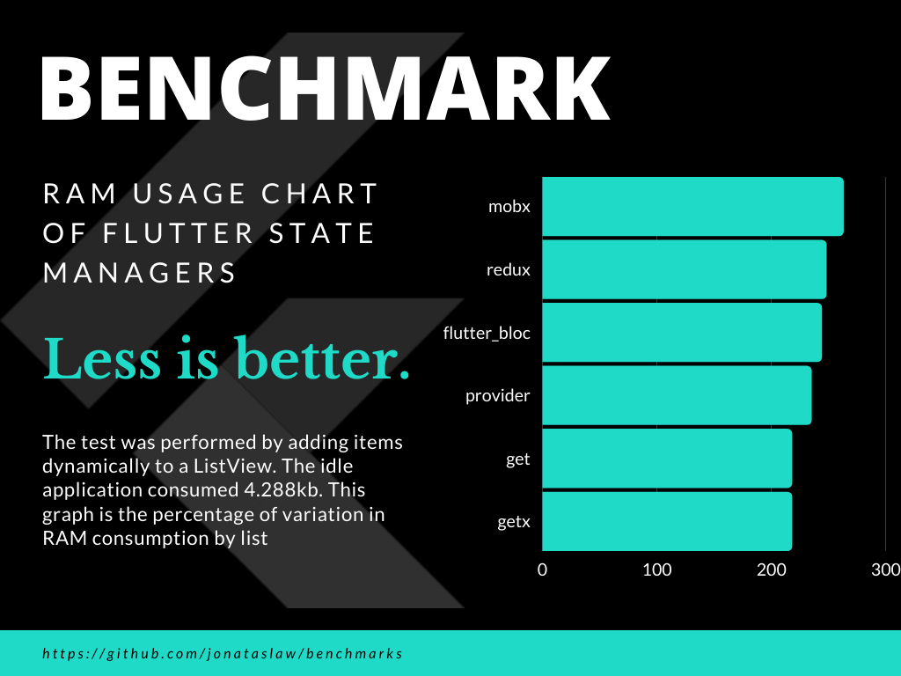

# benchmarks
A repository to benchmark Flutter libs.
Creators of the tested libs can suggest improvements, as long as they follow the same design structure.

# 1- State Managers

The idle application consumes 4.288k of ram.
Items were added dynamically to a ListView.
The amount of RAM was measured after the test, and the following calculation was made:
Number of RAM consumed by the app after testing with the state manager - RAM in idle state without any state manager.

In addition to the RAM calculation, the size of the apk was also observed after compilation. And we had the following results:

- flutter_bloc: 8.3mb
- mobx: 8.3mb
- provider: 8.3mb
- redux: 8.2mb
- get: 8.2mb
- getx: 8.2mb

The creators of flutter_bloc and provider made changes to use their library. If you want to make changes (within the scope of the project, without eliminating classes), you can do so by offering a PR.
