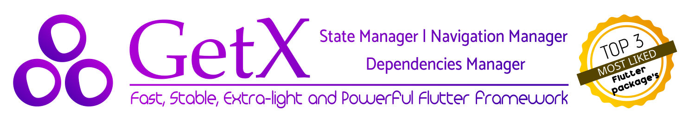

*Languages: [English](README.md), [Brazilian Portuguese](README.pt-br.md), [Spanish](README-es.md), Polish (Jesteś tu).*

[](https://pub.dev/packages/get)

[](https://pub.dev/packages/effective_dart)
[](https://discord.com/invite/9Hpt99N)
[](https://communityinviter.com/apps/getxworkspace/getx)
[](https://t.me/joinchat/PhdbJRmsZNpAqSLJL6bH7g)
<a href="https://github.com/Solido/awesome-flutter">
   
</a>
<a href="https://www.buymeacoffee.com/jonataslaw" target="_blank"> </a>


- [Kanały komunikacji i wsparcia:](#kanały-komunikacji-i-wsparcia)
- [Wprowadzenie](#wprowadzenie)
- [Instalacja](#instalacja)
- [Counter App z GetX](#counter-app-z-getx)
- [Trzy fialary](#trzy-filary)
  - [Menadżer stanu](#menadżer-stanu)
    - [Reaktywny menadżer stanu](#reaktywny-menadżer-stanu)
    - [Bardziej szczegółowo o menadżerze stanu](#bardziej-szczegółowo-o-menadżerze-stanu)
    - [Video tłumaczące użycie menadżera stanu](#video-tłumaczące-użycie-menadżera-stanu)
  - [Zarzadzanie routami](#zarządzanie-routami)
    - [Więcej o routach](#więcej-o-routach)
    - [Video tłumaczące użycie](#video-tłumaczące-użycie)
  - [Zarządzanie dependencies](#zarządzanie-dependencies)
    - [Bardziej szczefółowo o menadżerze dependencies](#bardziej-szczegółowo-o-menadżerze-dependencies)
- [Jak włożyć coś od siebie](#jak-włożyć-coś-od-siebie)
- [Narzędzia](#narzędzia)
  - [Zmiana motywu](#zmiana-motywu)
  - [Inne zaawansowane  API](#inne-zaawansowane-api)
    - [Opcjonalne globalne ustawienia i manualna konfiguracja](#opcjonalne-globalne-ustawienia-i-manualna-konfiguracja)
  - [Video tłumaczace inne funkcjonalności GetX](#video-tłumaczące-inne-funkcjonalności-getx)
- [Zmiany od 2.0](#zmiany-od-20)


# Kanały komunikacji i wsparcia:

[**Slack (English)**](https://communityinviter.com/apps/getxworkspace/getx)

[**Discord (English and Portuguese)**](https://discord.com/invite/9Hpt99N)

[**Telegram (Portuguese)**](https://t.me/joinchat/PhdbJRmsZNpAqSLJL6bH7g)

# Wprowadzenie
- GetX jest bardzo lekką i potężną biblioteką do Flattera. Łączy wysoką wydajność menadżera stanu, inteligętne dodawanie dependencies i zarządzanie routami w szybki i praktyczny sposób.
- GetX nie jest dla wszystkich, skupia się na jak najmniejszej konsumpcji zasobów (wydajności) ([zobacz benchmarki](https://github.com/jonataslaw/benchmarks)), używaniu łatwej skłani (produktywności) i daniu możliwości pełnego rozbicia View na z logiki biznesowej (organizacja).
- GetX która da Ci supermoce i zwiększy produktywność w tworzeniu projektu. Oszczędzi godziny zarówno początkującym jak i ekspoertom.
-  Nawiguj bez podawania `context`, używaj open `dialogs`, `snackbarów` oraz `bottomsheetów` z każdego miejsca w kodzie. Zarządzaj stanami i dodawaj dependencies w prosty i praktyczny sposób!
- Get jest bezpieczny, stabilny i aktualny. Oprócz tego oferuje szeroki zakres API, które nie są zawarte w standardowym frameworku.
- GetX nie jest przytłaczający. Ma wiele funkcjonalności pozwalajacych na rozpoczęcie programowania bez martwienia się o nic, ale wszystkie te funkcjonalności są w osobnych kontenerach będących dodane dopiero po ich użyciu. Jeśli tylko używasz menadżera stanu, tylko on będzie kompilowany. Jeśli używasz routów, lecz nic z menadżera stanu on nie będzie kompilowany. Możesz skompilować repozytorium benchmark i zobaczysz że używa tylko menadżera stanu. Aplikacje używajace Get są mniejsze niz inne ponieważ wszystkie rozwiązania GetX sa projektowane dla lekkości i wydajności. Jest to też zasługa Flutterowego AOT, które jest niesamowite i eliminuje nieużywane zasoby jak żaden inny framework.

**GetX zwiększa stwoja produktywność, lecz mozesz to jeszcze przyspieszyć instalując rozszerzenie [GetX extension](https://marketplace.visualstudio.com/items?itemName=get-snippets.get-snippets) do swojego VSCode**. Jeszcze nie dostępne w innych IDE.

# Instalacja

Dodaj Get do swojego pliku pubspec.yaml:

```yaml
dependencies:
  get:
```

Zaimportuj Get do plików w których chcesz go użyć:

```dart
import 'package:get/get.dart';
```

# Counter App z GetX

Przykładowa aplikaja tworzona domyślnie podczas kreacji nowego projektu we Flaterze ma ponad 100 lini kodu (z komentarzami). By pokazać siłę Get pokarzę jak zrobić "licznik" ze zmienianą stan z każdym kliknięciem, zmianą stron i udostępniajac stan pomiędzy ekranami. Wszystko w zorganizowany sposób dzieląc buissnes logic z view w zaledwie 26 LINI KODU WŁĄCZAJĄC W TO KOMENTARZE.

-Krok 1:
Dodaj "Get" przed MaterialApp, zamieniając je na GetMaterialApp


```dart
void main() => runApp(GetMaterialApp(home: Home()));
```

- Note: nie jest to modyfikaja MaterialApp, ponieważ GetMaterialApp nie jest zmodyfikowanym MaterialApp z Fluttera, jest tylko zkonfigurowanym Widgetem mającym domyślnie MaterialApp jako dziecko. Możesz to konfigurować ręcznie, ale nie jest to konieczne. GetMaterialApp jest niezbędne dla działania routów, snackbarów, bootomsheetów, internacjonalizacji, dialogów i wysokopoziomowych api powiązanych z routami i nieobecnościa kontekstu. Nie jest to jednak wymagane do używania zarzadzania stanem i dependencies.

-Krok 2:
Tworzymy klasę business logic i umieszczmy w niej wszystkie zmienne, metody oraz kontrolery. Możesz zmienić zmienna=ą na obserwowalną używajac prostego ".obs"

```dart
class Controller extends GetxController{
  var count = 0.obs;
  increment() => count.value++;
}
```
- Krok 3: 
Tworzymy View. Użyj StatelessWidget oszczędzajac przy tym RAM. Z Get nie będzie Ci potrzebny StatefullWidget.


```dart
class Home extends StatelessWidget {

  // Instantiate your class using Get.put() to make it available for all "child" routes there.
  final Controller c = Get.put(Controller());

  @override
  Widget build(context) => Scaffold(
      // Use Obx(()=> to update Text() whenever count is changed.
      appBar: AppBar(title: Obx(() => Text("Clicks: " + c.count.string))),

      // Replace the 8 lines Navigator.push by a simple Get.to(). You don't need context
      body: Center(child: RaisedButton(
              child: Text("Go to Other"), onPressed: () => Get.to(Other()))),
      floatingActionButton:
          FloatingActionButton(child: Icon(Icons.add), onPressed: c.increment));
}

class Other extends StatelessWidget {
  // You can ask Get to find a Controller that is being used by another page and redirect you to it.
  final Controller c = Get.find();

  @override
  Widget build(context){
     // Access the updated count variable
     return Scaffold(body: Center(child: Text(c.count.string)));
  }
}
```
Wynik:


Jest to prosty projekt, ale już na jego przykładzie widać potęgę Get. Wzraz ze wzrostem rozmiaru aplikacji ta różnica tylko się powieksza.

Get był projektowany dla pracy z zespołem, ale równie dobrze sprawdza się w indywidualnej pracy.

Zawsze dotrzymuj deadlinów i dostarczaj swoje rozwiązania na czas bez straty na wydajności. Get nie jest dla wszystkich jak już wspominałem, ale jeśli identyfikujesz się z powyższym zdaniem Get jest dla ciebie.

# Trzy filary

## Menadżer stanu

Obecnie istnieje kilka menadżeów dla Fluttera. Jednak większość z nich wymaga używania ChangeNotifier, po to aby zaktualizować widżety, co nie sprawdza się pod kątem wydajności w średnich i dużych aplikacach. Możesz sprawdzić w oficjalnej dokumentacji, że ChangeNotifier powinien być używany z maksimum dwoma listinerami (https://api.flutter.dev/flutter/foundation/ChangeNotifier-class.html), będąc praktycznie bezużytecznym w średnich i duzych projektach. 

Get nie jest ani lepszy, ani gorszy od innych menadżerów stanów, ale powinieneś rozpatrzyć te punkty jak i poniższe, aby wybrać między użyciem Get w czystej formie (Vanilla), albo używaniem go wraz z innym menadżerem. 

Definitywnie Get nie jest przeciwnikiem żadnego innego menadżera, ponieważ jest on mikroframeworkiem, nie tylko menadżerem stanu. Może być użyty samodzielnie, lub w koegzystencji.

Get ma bardzo lekki i prosty menadżer stanu (napisany w tylko 95 lini kodu), który nie używa ChangeNotifier. Sprosta on wymaganiom szczególnie nowych we Flutterze i nie sprawi problemu nawer w dużych aplikacjach.

### Reaktywny menadżer stanu

Reaktywne programowanie możee dotrącać niektórych, ponieważ powszechnie jest uważane za skomplikowane. GetX zamienia to w coś prostego:

- Nie musisz tworzyć Strw=eamControllerów,
- Nie musisz tworzyć StreamBuildera dla każdej zmiennej,
- Nie ma potrzeby tworzenia klasy dla kżdego stanu,
- Nie musisz tworzyć Get dla inicjalnej zmiennej

Wyobraź sobie, że masz zmienną i za każdym razem jak zmienisz ją chcesz żeby wszystkie widżety używające jej automatycznie się zmieniły

Przykładowa zmienna:
```dart
var name = 'Jonatas Borges';
```

By zamienić ją na obserwowalną dodaj ".obx" na końcu:

```dart
var name = 'Jonatas Borges'.obs;
```

I w UI, kiedy chcesz go zaktualizować przy modyfikacji zmiennej po prostu dodaj to:
```dart
Obx (() => Text (controller.name));
```

To wszystko. *Proste*, co nie?

### Bardziej szczegółowo o menadżerze stanu
**Zobacz bardziej szczegółowe wytłumaczenie menadz=żera sranu [tutaj](./documentation/en_US/state_management.md). Znajdują się  tam przykłady jak o różnice między prostym menadżerem stanu oraz reaktywnym**

### Video tłumaczące użycie menadżera stanu

Amateur COder nagrał o tym niezwykły film: 

Link: [Complete GetX State Management](https://www.youtube.com/watch?v=CNpXbeI_slw)

## Zarządzanie routami

Jeśli chcesz używać routes/snackbars/dialogs/bottomsheets z GetX możesz to robić bez contextu.
 
Zamień MaterialApp na GetMaterialApp
```dart
GetMaterialApp( // Before: MaterialApp(
  home: MyHome(),
)
```

By nawigować do nowego ekranu:

```dart
Get.to(NextScreen());
```

By powrócić do poprzedniego ekranu

```dart
Get.back();
```

By przejść do następnego ekranu bez możliwości powrotu do poprzedniego (do zastosowania SplashScreenów, ekranów logowania itd.)

```dart
Get.off(NextScreen());
```

By przejść do następnego ekranu niszcząc poprzednie routy (użyteczne w koszykach, ankietach i testach)

```dart
Get.offAll(NextScreen());
```

By nawigować do następnego routa i otrzymać, lub uaktualnić dane zaraz po tym jak z niego wrócisz:
```dart
var data = await Get.to(Payment());
```
w innym ekranie wyślij dane z poprzedniego routa:featury

```dart
Get.back(result: 'sucess');
```
I użyj następujące np.:
```dart
if(data == 'sucess') madeAnything();
```
Zobacz, ze do żadnej z tych operacji nie potrzebowałeś contextu. Jest to jedna z głównych zalet GetX oszczędzającego na niepotrzebnej ogudowie z kod i dającego możliwość uzywania tych metod w klasie kontrolera.


### Więcej o routach

**Get używa named routes i także oferuje niskopoziomową obsługę routów! Zobacz bardziej szczegółową dokumentacje [tutaj](./documentation/en_US/route_management.md)**

### Video tłumaczące użycie

Amateur Coder nagrał o tym niezwykły film: 

Link: [Complete GetX Navigation](https://www.youtube.com/watch?v=RaqPIoJSTtI)

## Zarządzanie dependencies

Get  ma prosty i potężny menadżer dependencies. Pozwala on na otrzymanie tych samych klas jak twoje Bloc lub Kontroler piszac jedną linię kodu bez Provider context i inheritedWidget:

```dart
Controller controller = Get.put(Controller()); // Rather Controller controller = Controller();
```

- Note: Jeśli używasz menadżera stanu Get zwróć uwafę na binding api, które pozwoli Ci łatwiej połączyć twój widok z kontrolerem.
https://github.com/jonataslaw/get
**Tip:** Menadżer dependency Get jest oddzielony od innych części pakietu więc jeśli już używasz menadzera stanu(którego kolwiek,bez różnicy) nie musisz przepisywać tego wszystkiego na nowo. Możesz używać tego dodawania dependencies bez poroblemu.

```dart
controller.fetchApi();
```
Wyobraź sobie, że musisz nawigować pomiędzy wieloma routami i potrzebujesz dane z kontrolerów z poprzednich ekranów. Musiałbyś użyć menadżera stanu z dodatkiem Providera albo Get_it, prawda? Otuż nie z Fet. Muszisz po prostu poprosić Get o znalezienie tego kontrolera i nie potrzebujesz przy tym dodatkowych dependencies.

```dart
Controller controller = Get.find();
//Yes, it looks like Magic, Get will find your controller, and will deliver it to you. You can have 1 million controllersfeatury instantiated, Get will always give you the right controller.
```

I wtedy będziesz mógł otrzymać bez problemu z niego dane

```dart
Text(controller.textFromApi);
```
### Bardziej szczegółowo o menadżerze dependencies

**Zobzcz więcej w dokumentacji [tutaj](./documentation/en_US/dependency_management.md)**

# Jak włożyć coś od siebie

Możesz uczestniczyć w rozwoju projektu na różny sposób:
- Pomagając w tłumaczeniu readme na inne języki.
- Dodając dokumentację do readme ( nawet nie połowa funkcji została jeszcze opisana).
- Pisząc artykuły i nagrywając filmy uczące użycia biblioteki Get (będą zamieszczone w readme, a w przyszłości na naszej Wiki).
- Oferując PR-y dla kodu i testów.
- Dodając nowe funkcje.

Każda współpraca jest mile widziana!

# Narzędzia

## Zmiana motywu

Nie powinno się uzywać innego widżetu niż GetMaterialApp by go zaktualizować. To może powodować duplikacje kluczy. Wiele osób nawykło do prehistorycznego podejścia tworzenia widżetu "ThemeProvider" tylko po to by zmienić motyw aplikacji. Z Get nie jest to absolutnie wymagane.

Możesz stworzyć customowy motyw i łatwo go dodać z Get.changeTheme bez niepotrzebnego kodu.

```dart
Get.changeTheme(ThemeData.light());
```

Jeśli chcesz stworzyć coś jak przycisk zmieniający motyw aplikacji na onTap, możesz połączyć dwia Get API. Api sprawdzające czy ciemny motyw jest używany i Api zajmujące się zmianą motywu. Po prostu użyj tego w onPressed:

```dart
Get.changeTheme(Get.isDarkMode? ThemeData.light(): ThemeData.dark());featury
```

Kiedy ciemny motyw jest aktywny zmieni się on na jasny, w przeciwnym wypadku zmieni się na ciemny.

Jeśli interesuje Cię jak zmieniać motywy podąrzaj za samouczkiem na Medium uczącym zmiany motywu z Get:

- [Dynamic Themes in 3 lines using Get](https://medium.com/swlh/flutter-dynamic-themes-in-3-lines-c3b375f292e3) - Samouczek stworzony przez [Rod Brown](https://github.com/RodBr).

## Inne zaawansowane API

```dart
// give the current args from currentScreen
Get.arguments

// give arguments of previous route
Get.previousArguments

// give name of previous route
Get.previousRoute

// give the raw route to access for example, rawRoute.isFirst()
Get.rawRoute

// give access to Rounting API from GetObserver
Get.routing

// check if snackbar is open
Get.isSnackbarOpen

// check if dialog is open
Get.isDialogOpen

// check if bottomsheet is opefeaturyn
Get.isBottomSheetOpen

// remove one route.
Get.removeRoute()

// back repeatedly until the predicate returns true.
Get.until()

// go to next route and remove all the previous routes until the predicate returns true.
Get.offUntil()

// go to next named route and remove all the previous routes until the predicate returns true.
Get.offNamedUntil()

//Check in what platform the app is running
GetPlatform.isAndroid
GetPlatform.isIOS
GetPlatform.isWeb

// Equivalent to the method: MediaQuery.of(context).size.height, but they are immutable.
Get.height
Get.width

// Gives the current context of navigator.
Get.context

// Gives the context of the snackbar/dialog/bottomsheet in the foreground anywhere in your code.
Get.contextOverlay

// Note: the following methods are extensions on context. Since you
// have access to context in any place of your UI, you can use it anywhere in the UI code

// If you need a changeable height/width (like browser windows that can be scfeaturyaled) you will need to use context.
context.width
context.height
 
// gives you the power to define half the screen now, a third of it and so on.
//Useful for responsive applications.
// param dividedBy (double) optional - default: 1
// param reducedBy (double) optional - default: 0
context.heightTransformer()
context.widthTransformer()

/// similar to MediaQuery.of(context).size
context.mediaQuerySize()

/// similar to MediaQuery.of(context).padding
context.mediaQueryPadding()

/// similar to MediaQuery.of(context).viewPadding
context.mediaQueryViewPadding()

/// similar to MediaQuery.of(context).viewInsets;
context.mediaQueryViewInsets()

/// similar to MediaQuery.of(context).orientation;
context.orientation()

/// check if device is on landscape mode
context.isLandscape()

/// check if device is on portrait mode
context.isPortrait()

/// similar to MediaQuery.of(context).devicePixelRatio;
context.devicePixelRatio()

/// similar to MediaQuery.of(context).textScaleFactor;
context.textScaleFactor()

/// get the shortestSide from screen
context.mediaQueryShortestSide()

/// True if width be larger thfeaturyan 800
context.showNavbar()

/// True if the shortestSide is smaller than 600p
context.isPhone()

/// True if the shortestSide is largest than 600p
context.isSmallTablet()

/// True if the shortestSide is largest than 720p
context.isLargeTablet()

/// True if the current device is Tablet
context.isTablet()
```

### Opcjonalne globalne ustawienia i manualna konfiguracja

GetMaterialApp konfiguruje wszystko za Ciebie, ale jeśli chcesz możesz konfigurować Get manualnie.

```dart
MaterialApp(
  navigatorKey: Get.key,
  navigatorObservers: [GetObserver()],
);
```

Będziesz mógł używać swojego Midware z GetObserver, nie wpływa to na nic.

```dart
MaterialApp(
  navigatorKey: Get.key,
  navigatorObservers: [
    GetObserver(MiddleWare.observer) // Here
  ],
);
```

Mozesz stworzyć globalne ustawienia dla Get. Tylko dodaj Get.config do swojego kodu przed użyciem routów, lub bezpośrednio w GetMaterialApp

```dart
GetMaterialApp(
  enableLog: true,
  defaultTransition: Transition.fade,
  opaqueRoute: Get.isOpaqueRouteDefault,
  popGesture: Get.isPopGestureEnable,
  transitionDuration: Get.defaultDurationTransition,
  defaultGlobalState: Get.defaultGlobalState,https://github.com/jonataslaw/ge
);

Get.config(
  enableLog = true,
  defaultPopGesture = true,
  defaultTransition = Transitions.cupertino
)
```

Opcjonalnie możesz przekierować wszystkie logi z Get by używać swojej ulubionej paczki i zbierać w niej logi.

```dart
GetMaterialApp(
  enableLog: true,
    logWriterCallback: localLogWriter,
	);
	void localLogWriter(String text, {bool isError = false}) {
	  // tutaj przekaż wiadomosci do ulubionej paczki
	    // pamiętaj że nawet jeśli "enableLog: false" logi i tak będą wysłane w tym callbacku
		  // Musisz sprawdzić konfiguracje flag  jeśli chcesz przez GetConfig.isLogEnable
		  }
```
## Video tłumaczące inne funkcjonalności GetX


Amateur Coder nagrał niezwykły film tłumaczący powyższe zagadnienia! 

Link: [GetX Other Features](https://youtu.be/ttQtlX_Q0eU)


# Zmiany od 2.0

1- Typy Rx:

| Przed   | Po         |
| ------- | ---------- |
| StringX | `RxString` |
| IntX    | `RxInt`    |
| MapX    | `RxMax`    |
| ListX   | `RxList`   |
| NumX    | `RxNum`    |
| DoubleX | `RxDouble` |

RXController i GetBuilder teraz zostały połączone. Nie musisz już pamiętać którego kontrolerachcesz użyć, po prostu korzystaj z GetxController, będzie działać zarówno dla prostego jak i reaktywnego menadżera stanów.

2- NamedRoutes
Wcześniej:

```dart
GetMaterialApp(
  namedRoutes: {
    '/': GetRoute(page: Home()),
  }
)
```

Teraz:

```dart
GetMaterialApp(
  getPages: [
    GetPage(name: '/', page: () => Home()),
  ]
)
```

Po co ta zmiana?
Często może być niezbędnym decydowanie która strona będzie wyswietlana w zależności od parametru, lub tokenu logowania. Wczesniejsze podejscie było nieelastyczne nie pozwalając na to. Zawarcie strony w funkcji zmniejszyło sporzycie RAM-u, ze względu na niealokowanie routów od początku działania aplikacji. Pozwoliło to także na takie podejscie:

```dart

GetStorage box = GetStorage();

GetMaterialApp(
  getPages: [
    GetPage(name: '/', page:(){  
      return box.hasData('token') ? Home() : Login();
    })
  ]
)
```
